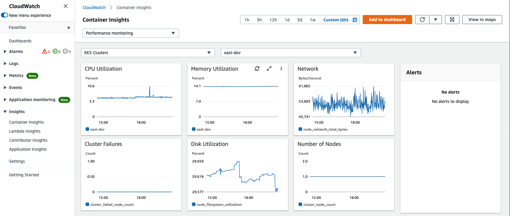
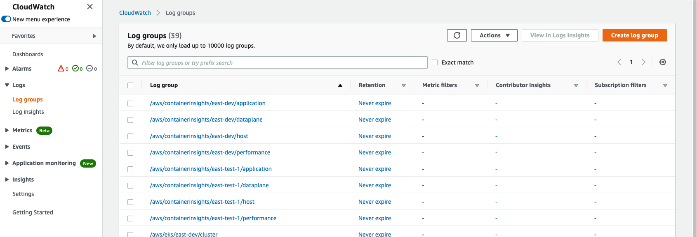
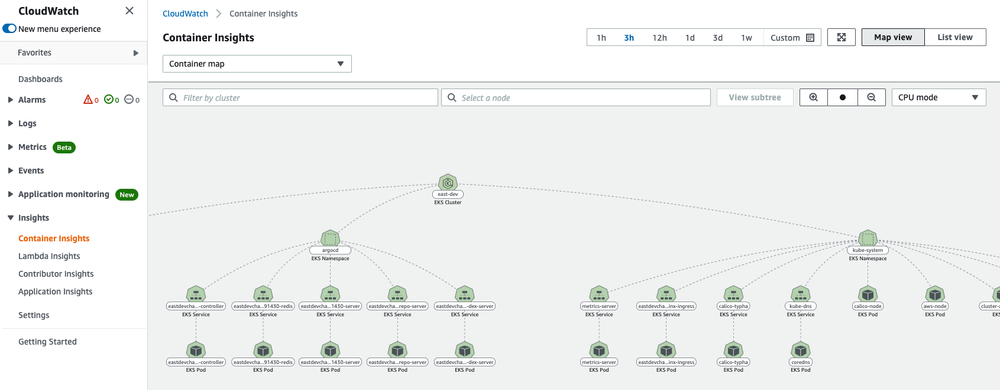

# Container Insights Add-on

The Container Insights add-on adds support for [Container Insights](https://docs.aws.amazon.com/AmazonCloudWatch/latest/monitoring/deploy-container-insights-EKS.html) to an EKS cluster.

Customers can use Container Insights to collect, aggregate, and summarize metrics and logs from your containerized applications and microservices. Container Insights collects data as performance log events using an embedded metric format. These performance log events are entries that use a structured JSON schema that enables high-cardinality data to be ingested and stored at scale. From this data, CloudWatch creates aggregated metrics at the cluster, node, pod, task, and service level as CloudWatch metrics. The metrics that Container Insights collects are available in CloudWatch automatic dashboards, and also viewable in the Metrics section of the CloudWatch console.

**IMPORTANT**

CloudWatch does not automatically create all possible metrics from the log data, to help you manage your Container Insights costs. However, you can view additional metrics and additional levels of granularity by using CloudWatch Logs Insights to analyze the raw performance log events.

Metrics collected by Container Insights are charged as custom metrics. For more information about [CloudWatch pricing](https://aws.amazon.com/cloudwatch/pricing/), see Amazon CloudWatch Pricing.

## Usage

Add the following as an add-on to your main.ts file to add Containers Insights to your cluster

```typescript
import { ContainerInsightsAddOn, , ClusterAddOn, EksBlueprint }  from '@aws-quickstart/ssp-amazon-eks';

const addOn = new ContainerInsightsAddOn();
const addOns: Array<ClusterAddOn> = [ addOn ];

const app = new cdk.App();
new EksBlueprint(app, 'my-stack-name', addOns, [], {
  env: {
      account: <AWS_ACCOUNT_ID>,
      region: <AWS_REGION>,
  },
});
```

## Prerequisites

Once the Container Insights add-on has been installed in your cluster, validate that the CloudWatch Agent and the FluentD daemons are running. 

```bash
`kubectl get all -n amazon-cloudwatch`
```

You should see output similar to the following: 

```
NAME                           READY   STATUS    RESTARTS   AGE
pod/cloudwatch-agent-k8wxl     1/1     Running   0          105s
pod/fluentd-cloudwatch-78zv4   1/1     Running   0          105s

NAME                                DESIRED   CURRENT   READY   UP-TO-DATE   AVAILABLE   NODE SELECTOR   AGE
daemonset.apps/cloudwatch-agent     1         1         1       1            1           <none>          107s
daemonset.apps/fluentd-cloudwatch   1         1         1       1            1           <none>          106s
```

To enable or disable control plane logs with the console, run the following command in your terminal.

```bash
aws eks update-cluster-config \
    --region us-east-2 \
    --name east-dev \
    --logging '{"clusterLogging":[{"types":["api","audit","authenticator","controllerManager","scheduler"],"enabled":true}]}'
```

You should see a similar output as the following.

```json
{
    "update": {
        "id": "<883405c8-65c6-4758-8cee-2a7c1340a6d9>",
        "status": "InProgress",
        "type": "LoggingUpdate",
        "params": [
            {
                "type": "ClusterLogging",
                "value": "{\"clusterLogging\":[{\"types\":[\"api\",\"audit\",\"authenticator\",\"controllerManager\",\"scheduler\"],\"enabled\":true}]}"
            }
        ],
        "createdAt": 1553271814.684,
        "errors": []
    }
}
```

You can also monitor the status of your log configuration update to your cluster by running the following command. 

```bash
aws eks describe-update \
    --region <region-code>\
    --name <prod> \
    --update-id <883405c8-65c6-4758-8cee-2a7c1340a6d9>
```

Once the update is complete, you should see a similar output.

```json
{
    "update": {
        "id": "<883405c8-65c6-4758-8cee-2a7c1340a6d9>",
        "status": "Successful",
        "type": "LoggingUpdate",
        "params": [
            {
                "type": "ClusterLogging",
                "value": "{\"clusterLogging\":[{\"types\":[\"api\",\"audit\",\"authenticator\",\"controllerManager\",\"scheduler\"],\"enabled\":true}]}"
            }
        ],
        "createdAt": 1553271814.684,
        "errors": []
    }
}
```

## View metrics for cluster and workloads

Under Performance Monitoring, the Container Insights dashboard allows you to hone in on both cluster and workload metrics. After selecting EKS Pods and Clusters, you will see that the dashboard provides CPU and memory utilization along with other important metrics such as network performance. 



## View cluster level logs

After you have enabled any of the control plane log types for your Amazon EKS cluster, you can view them on the CloudWatch console.

To view these logs on the CloudWatch console follow these steps:

1. Open the CloudWatch console and choose the cluster that you want to view logs for. The log group name format is /aws/eks/<cluster-name>/cluster.
2. Choose the log stream to view. The following list describes the log stream name format for each log type.
   1. Kubernetes API server component logs (api) – kube-apiserver-<nnn...>
   2. Audit (audit) – kube-apiserver-audit-<nnn...>
   3. Authenticator (authenticator) – authenticator-<nnn...>
   4. Controller manager (controllerManager) – kube-controller-manager-<nnn...>
   5. Scheduler (scheduler) – kube-scheduler-<nnn...>

Next in the console, click on Log groups under Logs. 

You will see under log streams all the log streams from your Amazon EKS control plane. 



## View workload level logs

In order to view workload level logs follow these steps after browsing to the CloudWatch Logs Insights console

In the navigation pane, choose Insights.

Near the top of the screen is the query editor. When you first open CloudWatch Logs Insights, this box contains a default query that returns the 20 most recent log events.

In the box above the query editor, select one of the Container Insights log groups to query. For the following example queries to work, the log group name must end with performance. We will look at `/aws/containerinsights/east-dev/performance`

When you select a log group, CloudWatch Logs Insights automatically detects fields in the data in the log group and displays them in Discovered fields in the right pane. It also displays a bar graph of log events in this log group over time. This bar graph shows the distribution of events in the log group that matches your query and time range, not only the events displayed in the table.

In the query editor, replace the default query with the following query and choose Run query.

STATS avg(node_cpu_utilization) as avg_node_cpu_utilization by NodeName
`SORT avg_node_cpu_utilization DESC`
This query shows a list of nodes, sorted by average node CPU utilization. Below is an example of what the visualization should look like.


To try another example, replace that query with another query and choose Run query. More sample queries are listed later on this page.

STATS avg(number_of_container_restarts) as avg_number_of_container_restarts by PodName
`SORT avg_number_of_container_restarts DESC`
This query displays a list of your pods, sorted by average number of container restarts as shown below


If you want to try another query, you can use include fields in the list at the right of the screen. For more information about query syntax, see CloudWatch Logs Insights Query Syntax.

## View containers via that container map in container insights.

In order to view a map of all of your containers running inside your cluster, click on `View your container map` in the Container Insights tab. You will then see a map of all of your namespaces and their associated pods and services.

